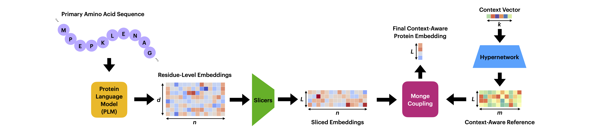

# Context-Aware Protein Representations Using Protein Language Models and Optimal Transport 

This repository contains implemention code for the paper [Context-Aware Protein Representations Using Protein Language Models and Optimal Transport](https://doi.org/10.64898/2026.01.24.701517)

## Overview

Proteins have different functions in different contexts. As a result, representations that take into account a protein’s biological context would allow for a more accurate assessment of its functions and properties. Protein language models (PLMs) generate amino-acid-level (residue-level) embeddings of proteins and are a powerful approach for creating universal protein representations. However, PLMs on their own do not consider context and cannot generate context-specific protein representations. We introduce COPTER, a method that uses optimal transport to pool together a protein's PLM-generated residue-level embeddings using a separate context embedding to create context-aware protein representations. We conceptualize the residue-level embeddings as samples from a probabilistic distribution, and use sliced Wasserstein distances to map these samples against a context-specific reference set, yielding a contextualized protein-level embedding. We evaluate COPTER's performance on three downstream prediction tasks: therapeutic drug target prediction, genetic perturbation response prediction, and TCR-epitope binding prediction. Compared to state-of-the-art baselines, COPTER achieves substantially improved, near-perfect performance in predicting therapeutic targets across cell contexts. It also results in improved performance in predicting responses to genetic perturbations and binding between TCRs and epitopes.



## Download Repo
Clone the Github repository.
```bash
git clone https://github.com/SahilP113/COPTER
cd COPTER
```

## Setup Environment

Create a conda environment called plm to obtain the PLM embeddings. 
```bash
conda env create -f plm.yml
conda activate plm
```

Create another conda environment called copter to run SWE pooling and the MLP. 
```bash
conda env create -f copter.yml
conda activate copter
```

## Download Data

### Therapeutic Target Prediction

The data for training PINNACLE and running the therapeutic target prediction task can be found here: [PINNACLE data](https://figshare.com/articles/software/PINNACLE/22708126) <br>
Download all three zip files: networks.zip, pinnacle_embeds.zip, and therapeutic_target_task.zip


### TCR-Epitope Binding Prediction

The tc-hard dataset used for the RN and NA tasks can be found here: [tc-hard data](https://zenodo.org/records/6962043) <br>
Run **data_prep/tc_hard_data_processing.ipynb** to obtain the data splits. 

The PanPep dataset used for the ET task is found here: [PanPep data](https://github.com/bm2-lab/PanPep/tree/main/Data) <br>
Download majority_training_dataset.csv and majority_testing_dataset.csv. <br>
Run **data_prep/pan_prep_data_processing.ipynb** to obtain the train, validation, and test splits. 


### Genetic Perturbation Response Prediction

Download Replogle K562 data: [K562_essential_raw_singlecell_01.h5ad](https://plus.figshare.com/ndownloader/files/35773219) <br>
Download Replogle RPE1 data: [rpe1_raw_singlecell_01.h5ad](https://plus.figshare.com/ndownloader/files/35775606) <br>
Run **data_prep/replogle_data_process** to process both the Replogle K562 and Replogle RPE1 data. 

Run **data/norman_data_process.ipynb** to both download and process the Norman K562 data. <br>
The data can also be downloaded here: [Norman data](https://dataverse.harvard.edu/api/access/datafile/6154020)

## Obtain PLM Embeddings

Before running SWE pooling, the protein language model embeddings must be obtained. Navigate into the PLM directory and activate the plm environment.
```bash
cd PLM
conda activate plm
```
For each task, add the file of amino acid sequences to the PLM/datasets folder. Then run the following command depending on the choice of PLM. 

### ESM-2 8M 
```bash
python run_dti.py --run-id dti_bindingdb_swepooling_100refpoints_freezeFalse_esm2_8m --config config/dti_bindingdb_esm2.yaml --pooling swe --num-ref-points 100 --freeze-swe False --target-model-type esm2_t6_8M_UR50D
```
### ESM-2 650M
```bash
python run_dti.py --run-id dti_bindingdb_swepooling_100refpoints_freezeFalse_esm2_650m --config config/dti_bindingdb_esm2.yaml --pooling swe --num-ref-points 100 --freeze-swe False --target-model-type esm2_t33_650M_UR50D
```
### Progen2 Small
```bash
python run_dti.py --run-id dti_bindingdb_swepooling_100refpoints_freezeFalse_progen2_small --config config/dti_bindingdb_progen2.yaml --pooling swe --num-ref-points 100 --freeze-swe False --target-model-type progen2-small
```

### Progen2 Large
```bash
python run_dti.py --run-id dti_bindingdb_swepooling_100refpoints_freezeFalse_progen2_large --config config/dti_bindingdb_progen2.yaml --pooling swe --num-ref-points 100 --freeze-swe False --target-model-type progen2-large
```


## Run Experiments

### Therapeutic Target Prediction

Predicting therapeutic targets of rheumatoid arthritis (RA) with ESM-2 8M:
```bash
python train_tt.py --task_name RA_esm2 --tt_disease  EFO_0000685 --plm esm2_8m --embeddings_dir data/therapeutic_target_data/pinnacle_embeds/ --hidden_dim_1 128 --hidden_dim_2 32 --batch_size 32 --num_seeds 1 --num_epoch 150
```

Predicting therapeutic targets of rheumatoid arthritis (RA) with Progen2 Small:
```bash
python train_tt.py --task_name IBD_esm2 --tt_disease EFO_0000685 --plm progen2_small --embeddings_dir data/therapeutic_target_data/pinnacle_embeds/ --hidden_dim_1 256 --hidden_dim_2 64 --batch_size 32 --num_seeds 1 --num_epoch 100
```

Predicting therapeutic targets of inflammatory bowel disease (IBD) with ESM-2 8M:
```bash
python train_tt.py --task_name RA_progen2 --tt_disease  EFO_0003767 --plm esm2_8m --embeddings_dir data/therapeutic_target_data/pinnacle_embeds/ --hidden_dim_1 128 --hidden_dim_2 32 --batch_size 32 --num_seeds 1 --num_epoch 100
```

Predicting therapeutic targets of inflammatory bowel disease (IBD) with Progen2 Small:
```bash
python train_tt.py --task_name IBD_progen2 --tt_disease  EFO_0003767 --plm progen2_small --embeddings_dir data/therapeutic_target_data/pinnacle_embeds/ --hidden_dim_1 256 --hidden_dim_2 64 --batch_size 32 --num_seeds 1 --num_epoch 100
```

### TCR-Epitope Binding Prediction


Predicting TCR-Epitope binding using random shuffling (RN) with ESM-2 8M:
```bash
python train_RN_NA.py --task_name RN_esm2 --tcr_epitope_task RN  --plm esm2_8m  --hidden_dim_1 128 --hidden_dim_2 32 --batch_size 64 --num_epoch 100
```

Predicting TCR-Epitope binding using random shuffling (RN) with Progen2 Small:
```bash
python train_RN_NA.py --task_name RN_progen2 --tcr_epitope_task RN --plm progen2_small --hidden_dim_1 256 --hidden_dim_2 64 --batch_size 64 --num_epoch 100
```

Predicting TCR-Epitope binding using experimental negatives (NA) with ESM-2 8M:
```bash
python train_RN_NA.py --task_name NA_esm2 --tcr_epitope_task NA --plm esm2_8m --hidden_dim_1 128 --hidden_dim_2 32 --batch_size 64 --num_epoch 100
```

Predicting TCR-Epitope binding using experimental negatives (NA) with Progen2 Small:
```bash
python train_RN_NA.py --task_name NA_progen2 --tcr_epitope_task NA --plm progen2_small --hidden_dim_1 256 --hidden_dim_2 64 --batch_size 64 --num_epoch 100
```

Predicting TCR-Epitope binding using external TCRs (ET) with ESM-2 8M:
```bash
python train_ET.py --task_name ET_esm2 --plm esm2_8m --hidden_dim_1 128 --hidden_dim_2 32 --batch_size 64 --num_epoch 100
```

Predicting TCR-Epitope binding using external TCRs (ET) with Progen2 Small:
```bash
python train_ET.py --task_name ET_progen2 --plm progen2_small --hidden_dim_1 256 --hidden_dim_2 64 --batch_size 64 --num_epoch 100
```

### Genetic Perturbation Response Prediction

Predicting genetic perturbation response using Replogle RPE1 with ESM-2:
```bash
python train_perturb_replogle.py --task_name replogle_rpe1_esm2 --perturb_task replogle_rpe1  --plm esm2_8m --hidden_dim_1 1024 --hidden_dim_2 2048 --batch_size 32 --num_epoch 50
```

Predicting genetic perturbation response using Replogle RPE1 with Progen2:
```bash
python train_perturb_replogle.py --task_name replogle_rpe1_progen2 --perturb_task replogle_rpe1  --plm progen2_small --hidden_dim_1 1024 --hidden_dim_2 2048 --batch_size 32 --num_epoch 50
```

Predicting genetic perturbation response using Replogle K562 with ESM-2:
```bash
python train_perturb_replogle.py --task_name replogle_k562_esm2 --perturb_task replogle_k562  --plm esm2_8m --hidden_dim_1 1024 --hidden_dim_2 2048 --batch_size 32 --num_epoch 50
```

Predicting genetic perturbation response using Replogle K562 with Progen2:
```bash
python train_perturb_replogle.py --task_name replogle_k562_progen2 --perturb_task replogle_k562  --plm progen2_small --hidden_dim_1 1024 --hidden_dim_2 2048 --batch_size 32 --num_epoch 50
```

Predicting genetic perturbation response using Norman K562 with ESM-2:
```bash
python train_perturb_norman.py --task_name norman_esm2 --plm esm2_8m --hidden_dim_1 1024 --hidden_dim_2 2048 --batch_size 64 --num_epoch 50
```

Predicting genetic perturbation response using Norman K562 with Progen2:
```bash
python train_perturb_norman.py --task_name norman_progen2 --plm progen2_small --hidden_dim_1 1024 --hidden_dim_2 2048 --batch_size 64 --num_epoch 50
```

## Citation
```bibtex
@article {Patel2026.01.24.701517,
	author = {Patel, Sahil and NaderiAlizadeh, Navid},
	title = {Context-Aware Protein Representations Using Protein Language Models and Optimal Transport},
	year = {2026},
	doi = {10.64898/2026.01.24.701517},
	publisher = {Cold Spring Harbor Laboratory},
	journal = {bioRxiv}
}
```
